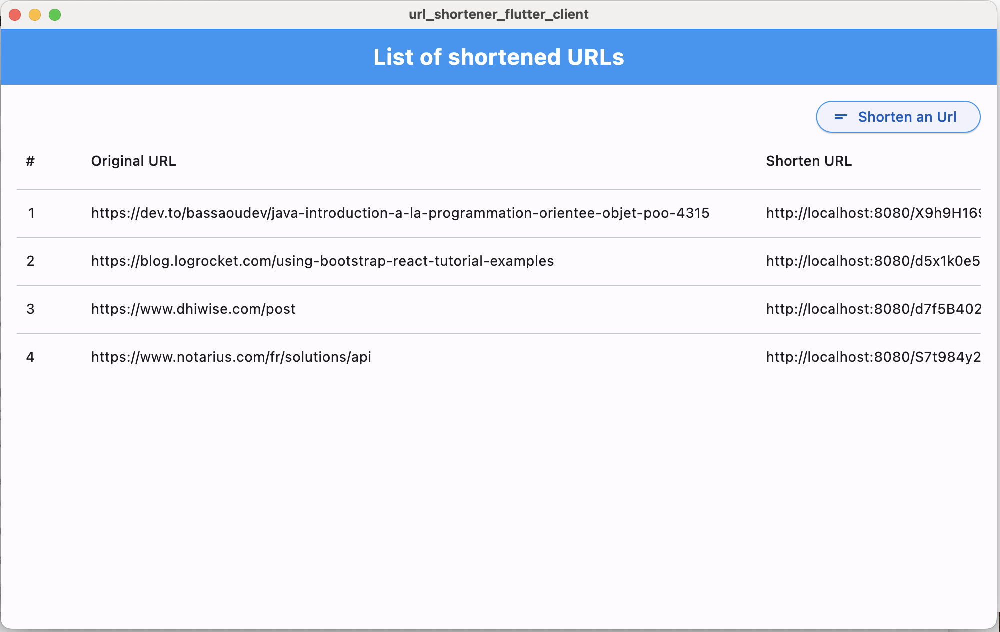
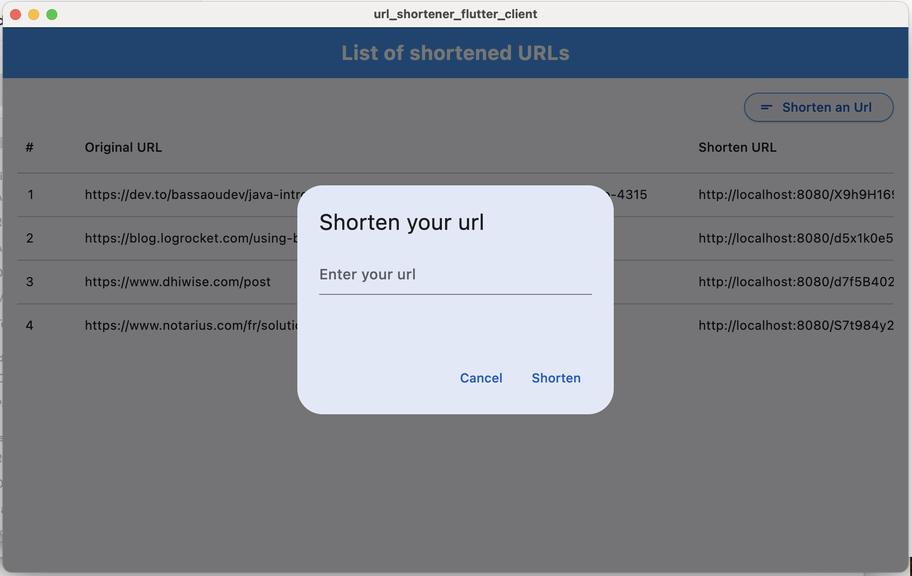
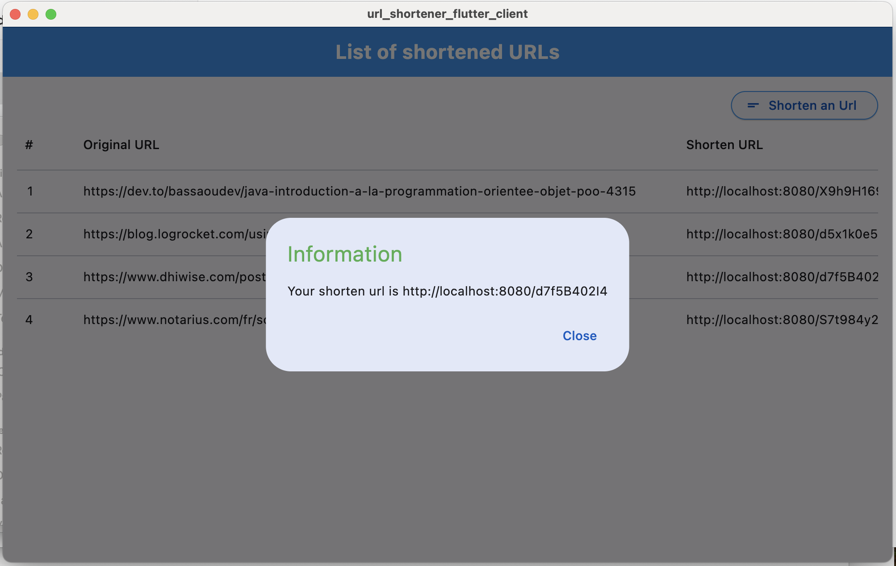

# Flutter Client Url Shortener

Simple Flutter App shortening long urls using material ui, BLOC architecture and chopper for network calls
This simple app consume Rest API From a Spring Boot Service

# Stack
* Dart
* Flutter
* DataTable
* Http
* Flutter Smart Dialog

# Usage
* Clone the repos with: git clone https://github.com/patken/url-shortener-flutter-client.git
* cd url-shortener-flutter-client
* flutter pub get (download dependencies)
* flutter run -d macOS

# Screenshots

# General Information

This project is a starting point for a Flutter application.

A few resources to get you started if this is your first Flutter project:

- [Lab: Write your first Flutter app](https://docs.flutter.dev/get-started/codelab)
- [Cookbook: Useful Flutter samples](https://docs.flutter.dev/cookbook)

For help getting started with Flutter development, view the
[online documentation](https://docs.flutter.dev/), which offers tutorials,
samples, guidance on mobile development, and a full API reference.
